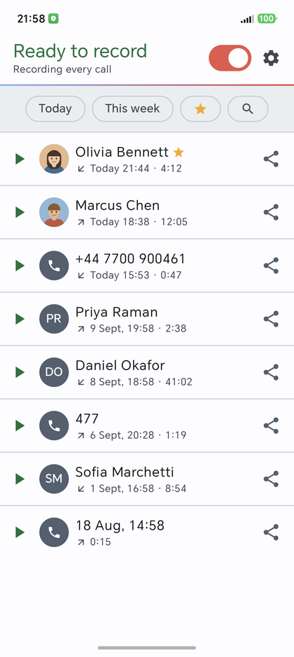
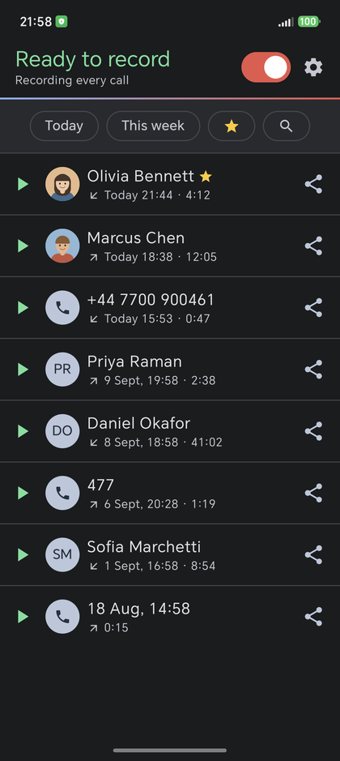
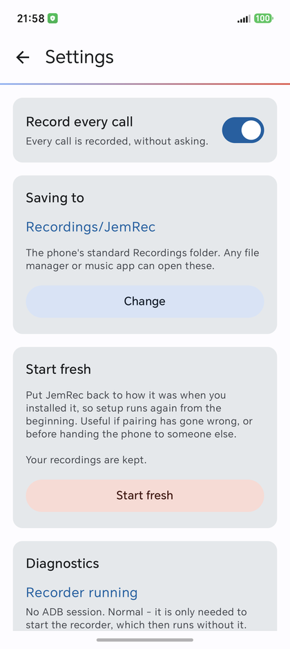
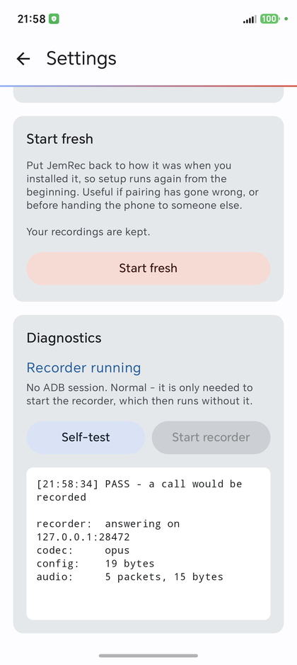
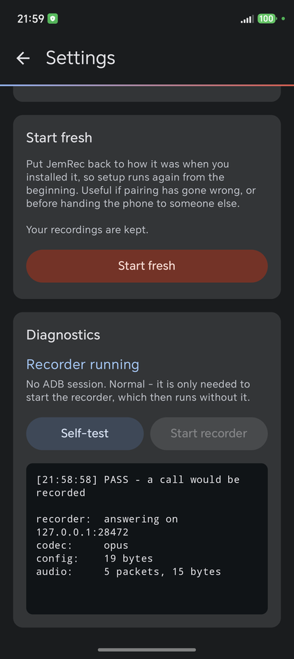

<div align="center">


# JemRec

**A call recorder for unrooted Android.**

One APK. No root, no Shizuku, no companion app, no computer — the phone sets
itself up.

[**Website**](https://jemcik.github.io/JemRec/) · [Privacy policy](https://jemcik.github.io/JemRec/privacy-policy.html) · [Releases](https://github.com/jemcik/JemRec/releases)

[](LICENSE)
[-3DDC84)](#requirements)
[](https://kotlinlang.org)
[](https://developer.android.com/jetpack/compose)
[](#tests)







</div>

> [!NOTE]
> The people in those screenshots do not exist. A screenshot of a call recorder
> is a screenshot of someone's calls, so the debug build fills the list with
> invented ones. Everything above the list is real.

## Install

Download the APK from [Releases](https://github.com/jemcik/JemRec/releases) and
open it. Android will ask whether to allow installing from your browser or file
manager; that is the sideload prompt, and it is the only way this app is
distributed. Every release is signed with the project key, so one release
upgrades the previous one in place.

**Play Protect may get in the way, and what it takes differs by phone.** It
warns about apps it has not seen before, which is every app that is not on
Play, so this is not a judgement about JemRec. Three phones, three outcomes:

| Phone | What happened |
| --- | --- |
| Honor Magic 8 Pro | Installed with no complaint. |
| Galaxy S20 | Refused. Turning Play Protect off long enough to install, then back on, worked. It is in the Play Store under your profile picture → Play Protect → Settings. |
| LineageOS | Refused from the browser. Opening the same file from the **Files** app installed it. Each app that can install needs *Install unknown apps* granted to it separately, and not every one of them is allowed to. |

If you want to check what you downloaded rather than trust it, every release
is signed with the same certificate and the release workflow prints its digest
on each run:

    apksigner verify --print-certs jemrec-0.2.apk
    SHA-256: 50aeab3630f0198ea3845db51413b1ad29582f78240fa2df6fe55ba8537afdf8

**It is not on Google Play and never will be.** Play removed call recorders in
2022 by forbidding the Accessibility API for recording, and no policy change
since has re-opened the door. That is a distribution decision, not a technical
one — the app itself never needed Play.

**Recording calls is your responsibility.** Consent law differs by country and
sometimes by state: one party, all parties, or a spoken notice. This app records
what you tell it to and warns nobody on your behalf.

> [!IMPORTANT]
> **A reboot kills the recorder, and building it again takes a few seconds of
> Wi-Fi.** Whether that happens without you comes down to one phone setting.
>
> **Allow JemRec to start automatically.** JemRec's Settings has a *Survive a
> restart* card whose button opens the right screen on your phone; on an Honor
> that is Settings → Battery → App launch → JemRec → *Manage manually*, with
> *Auto-launch* on. Measured on that phone: the app started at boot, and the
> recorder was back **ten seconds** after Wi-Fi came on, with the app never
> opened.
>
> **Without it, nothing happens by itself.** Same phone, auto-launch off: the
> system declined to start the app for the boot broadcast — `don't meet
> cpuload`, in its own log — so neither the scheduled job nor the Wi-Fi watcher
> was ever armed, and seven minutes after Wi-Fi returned nothing had come back.
> **Opening JemRec once** had it recording sixteen seconds later. That is the
> fallback, and it always works.
>
> Wi-Fi is needed to *rebuild* the recorder, never to use it. Once it is up,
> recording carries on with Wi-Fi off, on mobile data, anywhere.

## How it works

The whole design follows from one fact and one obstacle.

**The fact.** Android's `voice-call` audio source carries both sides of a call,
and reading it needs `CAPTURE_AUDIO_OUTPUT` and
`CAPTURE_VOICE_COMMUNICATION_OUTPUT` — signature-level permissions no ordinary
app can hold. But `com.android.shell`, the UID an ADB session runs as, holds
them both.

**The obstacle.** Getting shell privilege normally means a computer, or root, or
a second app like Shizuku that you keep alive. JemRec needs none of them,
because the phone can be its own computer.

### The phone is both ADB host and ADB device

The app embeds an ADB client. It pairs, over `127.0.0.1`, with the phone's own
Wireless debugging — the same SPAKE2 pairing a laptop does, with the six-digit
code, except both ends are on the same handset. Nothing leaves the phone, and no
network is involved beyond the loopback interface.

### ADB is a bootstrap, not a transport

The session exists for a few seconds. In it the app runs `pm grant` to give
*itself* `WRITE_SECURE_SETTINGS`, allow-lists a notification listener, and
launches a small Java daemon with `app_process` from a jar it carries as an
asset. Then it closes the session.

That matters because ADB is not there when you need it. With Wi-Fi off, `adbd`
tears its listener down completely, and the shell UID may not pin a port — so
anything that needed ADB at the moment a call arrives would simply not record.
A process spawned from an ADB shell, on the other hand, **outlives the
connection**. Start it once; talk to it forever over a loopback socket that
needs no network at all.

### The daemon records; the app collects

The daemon watches the call state itself and writes the call to a file. The app
is not on the audio path at all.

That split was forced by measurement. When the app muxed the live audio, this
phone's process manager froze it while the dialer was in front, its socket
reader stalled, and the tail of every call was lost: a 76.7-second call arrived
as 14 to 44 seconds. The daemon runs as shell, outside app management, and is
never frozen. Afterwards the app fetches the finished file at whatever pace the
system allows — a freeze there costs a slower copy, never a lost second.

### The socket is authenticated in both directions

Loopback is shared by every process on the phone, so the daemon's port would
otherwise let any app fetch a recording, delete one, or open a live capture of
the call in progress. Each connection now proves itself with an HMAC exchange
over a token the app generated and handed to the daemon in its environment:

```
app    ->  'A' + client nonce
daemon ->  daemon nonce + HMAC(token, "jemrec-daemon" | nonces)
app    ->  HMAC(token, "jemrec-client" | nonces) + command
```

The daemon proves itself **first**, because anything can bind that port while
the daemon is down and a scheme that sent the token as a password would hand it
over. The token never crosses the socket, and both nonces are fresh, so nothing
can be replayed. A bare ping needs no handshake and answers with the protocol
version and the daemon's build hash — which is how the app spots a daemon left
behind by an older install, and replaces it.

### Staying alive without Wi-Fi

Losing Wi-Fi restarts `adbd`, and the restart kills everything `adbd` spawned —
including the recorder. The counter is one setting: with USB debugging enabled
(the setting, no cable involved) the framework keeps `adbd` alive through the
loss of the wireless transport. The daemon minds that switch itself, every ten
seconds, because this phone turns it off on its own.

Proven on the device: no cable, Wi-Fi off, a real call recorded while `adbd` and
the daemon kept their process IDs across the outage.

When the daemon does die — a reboot kills it outright, and the system reclaims
it eventually — it has to be started again, and starting it is the one operation
that needs ADB and therefore Wi-Fi. A scheduled job and a system-held Wi-Fi
watcher do it without you: the app is woken when a network appears, rebuilds the
recorder in a few seconds, and stands the ADB session back down.

Both of those have to survive a reboot, and both are armed by the boot
broadcast — so on a phone whose ROM declines to start the app at boot, neither
exists and the repair never begins. That is the case above, and it is why the
manual says to open the app once after a restart rather than trusting the
machinery. **Between the restart and that moment nothing is recorded**, which is
why the header says so plainly rather than looking healthy.

### Recording, and being asked

Automatic mode records every call from the moment it goes off-hook. Ask-first
mode records **nothing** until you tap Record on the start-of-call notification,
so a declined call is never written to disk — the setting means what it says,
and the cost is the few seconds before the tap.

Recordings are Opus in an Ogg container, in the phone's standard
`Recordings/JemRec` folder, where any file manager or music app can open them.
You can point the app somewhere else.

### What it does not ask for

No `RECORD_AUDIO`. This app never opens an audio device — the shell-side process
does the capturing — and a call recorder that asks for the microphone anyway is
asking for something it does not use.

| Permission | Why |
| --- | --- |
| `INTERNET` | Not about the internet: Android requires it for any TCP socket, including one to `127.0.0.1`. |
| `WRITE_SECURE_SETTINGS` | Granted by the app to itself over its own ADB session. Nothing but a shell can grant it, so no user can be talked into it. |
| `POST_NOTIFICATIONS` | The recording notice, the ask-first prompt, the pairing code box. |
| `READ_MEDIA_AUDIO` | To list recordings made before a reinstall. Refusing it only hides those. |
| `READ_CALL_LOG`, `READ_CONTACTS` | Optional, offered once. The only way to label a recording with who the call was with. |

Three more (`READ_PHONE_STATE` and two storage permissions) are actively
**removed** from the manifest, because the ADB library's own manifest would
otherwise pull them in.

## Setup

Two things by hand, once, and the app watches for both:

1. **Turn on Developer options** — About phone, tap Build number seven times.
2. **Turn on USB debugging and Wireless debugging**, in any order. No cable is
   needed; USB debugging is what keeps Wireless debugging from switching itself
   off.
3. **Pair.** Open Wireless debugging, tap *Pair device with pairing code*, and
   type the six digits into JemRec's notification — not back in the app, because
   leaving the Settings screen closes the code window.

Everything after that is automatic. The pairing itself survives reboots — the
phone remembers it and you never type a code again — but the recorder does not,
so see the note above about Wi-Fi after a restart.

The long version, with what to do when a step misbehaves, is the manual:
[on the web](https://jemcik.github.io/JemRec/setup.html) or
[in this repository](docs/SETUP.md). They are one document rendered twice.

## Requirements

- **Android 12 (API 31) or newer.**
- **Developer options and Wireless debugging** — present on every Android phone,
  though the menu they live in differs by make. The app names the right path for
  your phone.
- **A phone whose audio HAL hands over `voice-call`.** This is the one thing
  that cannot be worked around, and it varies by manufacturer. Some phones give
  both sides of the call, some give one, some give silence.

**Both sides of the call** have been recorded on three phones, across three very
different Android builds:

| Phone | Build |
| --- | --- |
| Honor Magic 8 Pro (BKQ-N49) | MagicOS 10, Android 16 — the phone it was developed on |
| Samsung Galaxy S20 | One UI |
| OnePlus | LineageOS 23 |

Three is not a compatibility list, and the HAL is the part nobody can promise
for a phone they have not held. Settings → Diagnostics → **Self-test** answers
it on yours in about a second: it opens a real capture over the same path a
call takes and tells you what came out of it.

## Build

Needs **JDK 21** - that major, not "or newer" - and an Android SDK with:

    platforms;android-37       the app's compileSdk
    platforms;android-36       what the shell daemon links against
    build-tools;36.0.0         d8, for dexing the daemon

Then:

    ./gradlew assembleDebug

The daemon is not a Gradle module. `shellserver/build.sh` compiles it against the
platform the *device* runs, with its `@hide` internals intact, and Gradle runs
that script as part of every build and packages the jar as an app asset.

The JDK major is exact because the daemon's bytes depend on it: measured, JDK 17
and JDK 21 turn the same sources into dex files 264 bytes apart, and an APK that
differs by machine is one F-Droid cannot reproduce. 21 is what F-Droid's build
server runs, so 21 is what CI installs and what `build.sh` insists on -
`JEMREC_JAVA_HOME` points it at one if the default is something else.

## Tests

55 JVM unit tests, no device needed:

    ./gradlew :app:testDebugUnitTest

They cover the parts where a mistake is silent: the list's filtering (shared by
select-all, so a wrong answer is a wrong bulk delete), the daemon's wire format,
the setup state machine and every regression its comments describe, the Opus
header, the call-log match, and the home screen's selection logic.

A pre-push hook runs the tests and lint before anything leaves the machine:

    git config core.hooksPath tools/hooks

## Releases

Bump the version in a pull request, tag the merge, and CI does the rest:

    # gradle.properties: jemrecVersionName=0.3, jemrecVersionCode=300
    # fastlane/metadata/android/en-US/changelogs/300.txt: what changed
    # ...merged to main as a PR, like everything else; main takes no direct push
    git checkout main && git pull && git tag 0.3 && git push origin 0.3

The version lives in `gradle.properties` and nowhere else, because that is
where F-Droid's update checker reads it from at each tag. The workflow refuses
a tag that disagrees with it, or a `versionCode` that is not
`MAJOR*10000 + MINOR*100 + PATCH`, then builds a release APK signed with the
project key held in repository secrets, refuses to publish anything
`apksigner` cannot verify, and attaches `jemrec-0.3.apk` to the release.

The tag has to point at a commit **on main**, because that commit is what
F-Droid builds and what the APK's own version-control stamp names. A tag
pushed alongside a rejected push of main goes up anyway, pointing at a commit
nothing else can see - which is how this paragraph came to be written.

The signing key is the thing that makes an upgrade possible: an APK signed with
a different certificate cannot install over an earlier one, whatever its version
number. It lives outside this repository and always has — see `.gitignore`,
which has refused signing material since before any existed.

**The build is reproducible**, and that is what lets F-Droid carry the same
key: F-Droid builds each tag on its own machine, checks the result against the
APK on the release page byte for byte, and publishes the release APK, signed
here, when they match. Three things used to differ, each found by building a
tag on a second machine and diffing against the release: the daemon jar's
`zip` step stamped in the build's wall-clock time (`d8` now writes the jar,
with the epoch); AGP stripped the native libraries only where an NDK happened
to be installed (they are now packaged as shipped); and `javac` 17 and 21 do
not agree on the daemon's bytecode (the major is now pinned and checked).

## Licence

Apache-2.0. See [LICENSE](LICENSE), and [NOTICE.md](NOTICE.md) for what is
vendored and under what terms — chiefly an audio-only fork of
[scrcpy](https://github.com/Genymobile/scrcpy)'s server in `shellserver/`, whose
every modification is listed in [shellserver/PATCHES.md](shellserver/PATCHES.md).

## Docs

| | |
| --- | --- |
| [SETUP.md](docs/SETUP.md) | The end-user manual: every step, and what to do when one of them misbehaves. Generated by `tools/build_site.py` along with [the same page on the site](https://jemcik.github.io/JemRec/setup.html) — edit it there, or the two drift, which is exactly how the last copy came to describe a permission the app no longer asks for. |
| [ADB-NOTES.md](docs/ADB-NOTES.md) | Four undocumented behaviours of the ADB library, each measured, each of which cost a day. |
| [fastlane/metadata](fastlane/metadata/android/en-US) | The F-Droid listing: description, per-version changelogs, icon and screenshots. The icon and screenshots are written by `tools/render_icon.py` and `tools/shoot.py` alongside the README's, so the store shows the app the README shows. |

Everything else that would have gone in a document is in the code, beside the
thing it explains: why the timestamps are counted rather than read, why an idle
call state is not believed the first time, why the daemon polls a setting
instead of observing it. Each of those comments records the measurement it came
from, because the reason is the part that stops someone undoing it.
